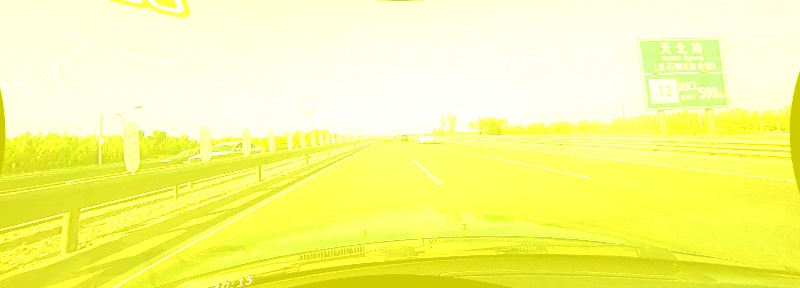

# LaneNet lane detection in Pytorch

LaneNet is a segmentation-tasked lane detection algorithm, described in [1] "[Towards end-to-end lane detection: an instance segmentation approach](https://arxiv.org/pdf/1802.05591.pdf)" . The key idea of instance segmentation should be referred to [2] "[Semantic instance segmentation with a discriminative loss function](https://arxiv.org/pdf/1708.02551.pdf)". This repository contains a re-implementation in Pytorch.

## Demo Test

For single image demo test:

```Bash
python demo_test.py -i path/to/img 
                    -w path/to/weight
                    -b band_width
                    [--visualize / -v]
```
Contoh:
```Bash
python demo_test.py -i demo/demo.jpg -w experiments/exp10/exp10_best.pth -b 1.5 -v
```



## Predict Video

For single image demo test:

```Bash
python predict_video.py -v path/to/video
                        -w path/to/weight
                        -b band_width
                        -o path/to/folder/output
```
Contoh:
```Bash
python predict_video.py -i demo/demo.mp4 -w experiments/exp10/exp10_best.pth -b 1.5 -o experiments/exp10/
```


## Persiapan data

## Membuat dataset sendiri
Dataset yang dibuat mengikuti format tusimple ya itu sebagai berikut
```
My_dataset_path
├── clips
├── label_train.json
├── label_val.json
└── label_test.json
```
### Membuat dataset dari video

```Bash
python create_clips_dataset.py --src_dir path/to/store/dataset
                               --video_path path/to/video/source
                               -fps 30 (setting berapa frame yg akan diambil per detik)
                               -fpd 20 (setting berapa frame yg akan disimpan per folder)
```
Contoh:
```Bash
python create_clips_dataset.py --src_dir data/project_data --video_path /data/documents/video.mp4 -fps 30 -fpd 20
```

Hasil outputnya adalah
```
My_dataset_path
├── clips
└── labelling
```
Berikutnya adalah melabeli dengan vgg anotator, dapat di download di "[VGG Image Annotator (VIA)
](http://www.robots.ox.ac.uk/~vgg/software/via)". Kemudian simpan semua label `json` di folder `My_dataset_path`.

**Note**
- Nama folder `My_dataset_path` boleh diganti apa saja sesuai keinginan/keperluan.

### Konvert `label.json` ke format label tusimple

```
Kode dan file python menyusul
```

### Edit `config.py` 
Edit path pada bagian Tusimple sesuai dengan path yg sebelumnya telah dibuat 
```
Dataset_Path = dict(
    ...
    Tusimple = "/home/lion/Dataset/tusimple"
)
```

## Train 

1. Buat folder experiment di dalam folder `experiments`, misal `experiments/exp12`.  Assign the path to variable `exp_dir` in `train.py`.

2. Copy `cfg.json` yang ada di folder experiment sebelumnya dan paste ke dalam foldr experiment yang baru. Kemudian modifikasi parameter yang ada di `cfg.json`.
   ```json
   {
    "dataset": {
               "resize_shape": [640, 360], 
               "dataset_name": "Tusimple", "batch_size": 2
               },
    "device": "cuda:0",
    "net": {
            "delta_v": 0.5,
            "delta_d": 3.0,
            "scale_lane_line": 1.0,
            "scale_var": 1.0,
            "scale_dist": 1.0,
            "scale_reg": 0.001 
            },
    "optim": { "lr": 0.0005 },
    "NUM_EPOCH": 100,
    "MAX_ITER": 20000
   }

   ```

3. Start training:

   ```python
   python train.py --exp_dir ./experiments/exp-keN
                   [--resume / -r] (kosongkan jika mulai dari awal)
   ```
   contoh
   ```python
   python train.py --exp_dir ./experiments/exp12
   ```

4. Monitor on tensorboard:

   ```Bash
   tensorboard --logdir experiments/exp0/log
   ```
   load multiple log tensorboard
   ```Bash
   tensorboard --logdir_sec exp0:experiments/exp0/log,exp1:experiments/exp1/log,exp2:experiments/exp2/log,...
   ```


## Reference

[1]. Neven, Davy, et al. "[Towards end-to-end lane detection: an instance segmentation approach.](https://arxiv.org/pdf/1802.05591.pdf)" *2018 IEEE Intelligent Vehicles Symposium (IV)*. IEEE, 2018.

[2]. De Brabandere, Bert, Davy Neven, and Luc Van Gool. "[Semantic instance segmentation with a discriminative loss function.](https://arxiv.org/pdf/1708.02551.pdf)" *arXiv preprint arXiv:1708.02551* (2017).

