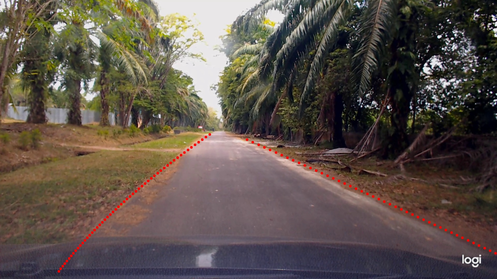

# LaneNet lane detection in Pytorch

LaneNet adalah algoritma deteksi jalur, dijelaskan pada [1] "[Towards end-to-end lane detection: an instance segmentation approach](https://arxiv.org/pdf/1802.05591.pdf)" . Ide pokok dari instance segmentation merujuk pada [2] "[Semantic instance segmentation with a discriminative loss function](https://arxiv.org/pdf/1708.02551.pdf)".

Repositori ini adalah implementasi ulang menggunakan pytorch dan modifikasi dari kode sumber [LaneNet](https://github.com/harryhan618/LaneNet)

## Packages & Softwares

**Packages**
- python 3.7
- pytorch 1.5
- opencv 3.4
- scikit-learn 0.23
- tensorboard 2.3

**Software**
- NVIDIA GPU drivers
- CUDA Toolkit: CUDA 10.1
- cuDNN SDK 7.6 >=

## Demo Test

Untuk test satu gambar:

```Bash
python demo_test.py -i path/to/img 
                    -w path/to/weight
                    -b band_width
                    [--visualize / -v]
```
Contoh:
```Bash
python demo_test.py -i demo/demo.jpg -w experiments/exp10/exp10_best.pth -b 1.5 -v
```



## Predict Video

Untuk test video:

```Bash
python predict_video.py -v path/to/video
                        -w path/to/weight
                        -b band_width
                        -o path/to/folder/output
```
Contoh:
```Bash
python predict_video.py -i demo/demo.mp4 -w experiments/exp10/exp10_best.pth -b 1.5 -o experiments/exp10/
```


## Persiapan data

## Membuat dataset sendiri
Dataset yang dibuat mengikuti format tusimple ya itu sebagai berikut
```
My_dataset_path
├── clips
├── label_train.json
├── label_val.json
└── label_test.json
```
### Membuat dataset dari video

1. Jalan kan perintah berikut
   ```Bash
   python data_prep/create_clips_dataset.py --src_dir path/to/store/dataset
                                            --video_path path/to/video/source
                                            -fps 30 (setting berapa frame yg akan diambil per detik)
                                            -fpd 20 (setting berapa frame yg akan disimpan per folder)
   ```
   Contoh:
   ```Bash
   python data_prep/create_clips_dataset.py --src_dir data/project_data --video_path /data/documents/video.mp4 -fps 30 -fpd 20
   ```

   Hasil outputnya adalah
   ```
   My_dataset_path
   ├── clips
   └── labelling
   ```
   Berikutnya adalah melabeli dengan vgg anotator, dapat di download di "[VGG Image Annotator (VIA)
   ](http://www.robots.ox.ac.uk/~vgg/software/via)". Kemudian simpan semua label `json` di folder `My_dataset_path`.

   **Note**
   - Nama folder `My_dataset_path` boleh diganti apa saja sesuai keinginan/keperluan.

2. Ubah `label.json` ke format label tusimple
   ```Bash
   python data_prep/convert_json_via_tusimple.py --json_path path/to/json/file
                                                 --save_samples (True/False default is False)
   ```
   Contoh:
   ```Bash
   python data_prep/convert_json_via_tusimple.py --json_path data/project_data/label_via_project.json --save_samples False
   ```

3. Modifikasi `config.py` 
   Modifikasi path pada bagian Tusimple sesuai dengan path yg sebelumnya telah dibuat 
   ```
   Dataset_Path = dict(
       ...
       Tusimple = "/home/lion/Dataset/tusimple"
   )
   ```

## Train 

1. Buat folder experiment di dalam folder `experiments`, misal `experiments/exp12`.

2. Copy `cfg.json` yang ada di folder experiment sebelumnya dan paste ke dalam foldr experiment yang baru. Kemudian modifikasi parameter yang ada di `cfg.json`.
   ```json
   {
    "dataset": {
               "resize_shape": [640, 360],
               "dataset_name": "Tusimple",
               "batch_size": 2 
               },
    "device": "cuda:0",
    "net": {
            "delta_v": 0.5,
            "delta_d": 3.0,
            "scale_lane_line": 1.0,
            "scale_var": 1.0,
            "scale_dist": 1.0,
            "scale_reg": 0.001 
            },
    "optim": { "lr": 0.0005 },
    "NUM_EPOCH": 100,
    "MAX_ITER": 20000
   }
   ```
   **Deskripsi**
   - `dataset`:
            - `resize_shape`: ukuran gambar yang akan dimasukkan ke pelatihan model
            - `dataset_name`: type dataset yg akan di load. dalam kasus ini adalah tusimple. karena format dataset yg dibuat mengikuti format tusimple
            - `batch_size`: ukuran batch, adalah jumlah gambar yg di load setiap iterasi
   - `device`: adalah penentuan cpu atau gpu yang akan digunakan untuk pelatihan model
   - `net`: parameter yg ada di net mengikuti kedua jurnal. untuk penjelasannya bisa dilihat di jurnal
   - `optim`: parameter untuk optimizer.
            karena dalam beberapa experiment menggunakan dua optimizer yg berbeda. maka untuk memebedakannya adalah: 
            - jika parameter di dalam optim ada dua yaitu `lr` dan `momentum` maka optimizer yg digunakan adalah SGD
            - jika paremater di dalam optim hanya ada satu yaitu `lr` saja maka optimizer yg digunakan adalah Adam

    **Note**
    Setiap experiment memiliki setting parameter yg berbeda

3. Start training:

   ```Bash
   python train.py --exp_dir ./experiments/exp-keN
                   [--resume / -r] (kosongkan jika mulai dari awal)
   ```
   contoh
   ```Bash
   python train.py --exp_dir ./experiments/exp12
   ```

4. Monitor on tensorboard:

   ```Bash
   tensorboard --logdir experiments/exp0/log
   ```
   load multiple log tensorboard
   ```Bash
   tensorboard --logdir_sec exp0:experiments/exp0/log,exp1:experiments/exp1/log,exp2:experiments/exp2/log,...
   ```

## Evaluate
Untuk mengevaluasi salah satu model terbaik dari beberapa experiment

```Bash
python evaluate.py --exp_dir ./experiments/exp5
```

## Reference

[1]. Neven, Davy, et al. "[Towards end-to-end lane detection: an instance segmentation approach.](https://arxiv.org/pdf/1802.05591.pdf)" *2018 IEEE Intelligent Vehicles Symposium (IV)*. IEEE, 2018.

[2]. De Brabandere, Bert, Davy Neven, and Luc Van Gool. "[Semantic instance segmentation with a discriminative loss function.](https://arxiv.org/pdf/1708.02551.pdf)" *arXiv preprint arXiv:1708.02551* (2017).

